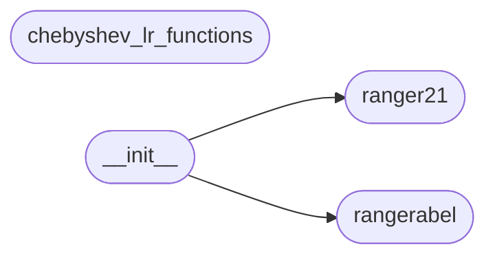

# Code Overview

[_Documentation generated by Documatic_](https://www.documatic.com)

<!---Documatic-section-Codebase Structure Python-start--->
## Codebase Structure Python

The codebase has a flat structure, with 4 code files.

<!---Documatic-block-system_architecture-start--->

<!---Documatic-block-system_architecture-end--->

# #
<!---Documatic-section-Codebase Structure Python-end--->

<!---Documatic-section-Key Objects-start--->
## Key Objects

There are exposed imports at level-0
from the source directory (ranger21)

<!---Documatic-block-ranger21-start--->

	
<code>ranger21</code> (Click to Expand!)

* `ranger21.ranger21.Ranger21`
* `ranger21.rangerabel.Ranger21abel`

<!---Documatic-block-ranger21-end--->

# #
<!---Documatic-section-Key Objects-end--->

<!---Documatic-section-Important Functions-start--->
## Important Functions

<!---Documatic-block-important_funcs-start--->
<!---Documatic-block-end_user_funcs-start--->
### End User Exposed Functions

* ranger21.ranger21.Ranger21
* ranger21.rangerabel.Ranger21abel
<!---Documatic-block-end_user_funcs-end--->
<!---Documatic-block-important_funcs-end--->

# #
<!---Documatic-section-Important Functions-end--->

<!---Documatic-section-Class Hierarchy-start--->
## Class Hierarchy

<!---Documatic-block-TO.Optimizer-start--->

	
<code>TO.Optimizer</code> (Click to Expand!)

* ranger21.ranger21.Ranger21
* ranger21.rangerabel.Ranger21abel

<!---Documatic-block-TO.Optimizer-end--->

# #
<!---Documatic-section-Class Hierarchy-end--->

[_Documentation generated by Documatic_](https://www.documatic.com)