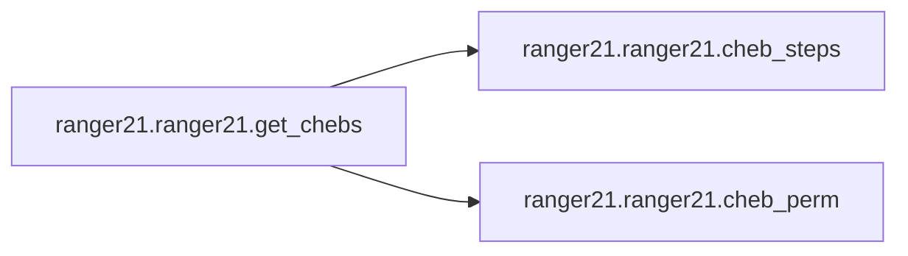

# Ranger21 Ranger21

[_Documentation generated by Documatic_](https://www.documatic.com)

<!---Documatic-section-Codebase Structure-start--->
## Codebase Structure

<!---Documatic-block-system_architecture-start--->
```mermaid
None
```
<!---Documatic-block-system_architecture-end--->

# #
<!---Documatic-section-Codebase Structure-end--->

<!---Documatic-section-ranger21.ranger21.cheb_steps-start--->
## [ranger21.ranger21.cheb_steps](3-ranger21_ranger21.md#ranger21.ranger21.cheb_steps)

<!---Documatic-section-cheb_steps-start--->
<!---Documatic-block-ranger21.ranger21.cheb_steps-start--->
<details>
	<summary><code>ranger21.ranger21.cheb_steps</code> code snippet</summary>

```python
def cheb_steps(m, M, T):
    (C, R) = ((M + m) / 2.0, (M - m) / 2.0)
    thetas = (np.arange(T) + 0.5) / T * np.pi
    return 1.0 / (C - R * np.cos(thetas))
```
</details>
<!---Documatic-block-ranger21.ranger21.cheb_steps-end--->
<!---Documatic-section-cheb_steps-end--->

# #
<!---Documatic-section-ranger21.ranger21.cheb_steps-end--->

<!---Documatic-section-ranger21.ranger21.cheb_perm-start--->
## [ranger21.ranger21.cheb_perm](3-ranger21_ranger21.md#ranger21.ranger21.cheb_perm)

<!---Documatic-section-cheb_perm-start--->
<!---Documatic-block-ranger21.ranger21.cheb_perm-start--->
<details>
	<summary><code>ranger21.ranger21.cheb_perm</code> code snippet</summary>

```python
def cheb_perm(T):
    perm = np.array([0])
    while len(perm) < T:
        perm = np.vstack([perm, 2 * len(perm) - 1 - perm]).T.flatten()
    return perm
```
</details>
<!---Documatic-block-ranger21.ranger21.cheb_perm-end--->
<!---Documatic-section-cheb_perm-end--->

# #
<!---Documatic-section-ranger21.ranger21.cheb_perm-end--->

<!---Documatic-section-ranger21.ranger21.get_chebs-start--->
## [ranger21.ranger21.get_chebs](3-ranger21_ranger21.md#ranger21.ranger21.get_chebs)

<!---Documatic-section-get_chebs-start--->


### Object Calls

* [ranger21.ranger21.cheb_steps](3-ranger21_ranger21.md#ranger21.ranger21.cheb_steps)
* [ranger21.ranger21.cheb_perm](3-ranger21_ranger21.md#ranger21.ranger21.cheb_perm)

<!---Documatic-block-ranger21.ranger21.get_chebs-start--->
<details>
	<summary><code>ranger21.ranger21.get_chebs</code> code snippet</summary>

```python
def get_chebs(num_epochs):
    num_epochs = num_epochs - 2
    steps = cheb_steps(0.1, 1, num_epochs)
    perm = cheb_perm(num_epochs)
    cheb_schedule = steps[perm]
    print(f'cheb schedule made with len {len(cheb_schedule)}')
    return cheb_schedule
```
</details>
<!---Documatic-block-ranger21.ranger21.get_chebs-end--->
<!---Documatic-section-get_chebs-end--->

# #
<!---Documatic-section-ranger21.ranger21.get_chebs-end--->

<!---Documatic-section-ranger21.ranger21.normalize_gradient-start--->
## [ranger21.ranger21.normalize_gradient](3-ranger21_ranger21.md#ranger21.ranger21.normalize_gradient)

<!---Documatic-section-normalize_gradient-start--->
<!---Documatic-block-ranger21.ranger21.normalize_gradient-start--->
<details>
	<summary><code>ranger21.ranger21.normalize_gradient</code> code snippet</summary>

```python
def normalize_gradient(x, use_channels=False, epsilon=1e-08):
    size = x.dim()
    if size > 1 and use_channels:
        s = x.std(dim=tuple(range(1, size)), keepdim=True) + epsilon
        x.div_(s)
    elif torch.numel(x) > 2:
        s = x.std() + epsilon
        x.div_(s)
    return x
```
</details>
<!---Documatic-block-ranger21.ranger21.normalize_gradient-end--->
<!---Documatic-section-normalize_gradient-end--->

# #
<!---Documatic-section-ranger21.ranger21.normalize_gradient-end--->

<!---Documatic-section-ranger21.ranger21.centralize_gradient-start--->
## [ranger21.ranger21.centralize_gradient](3-ranger21_ranger21.md#ranger21.ranger21.centralize_gradient)

<!---Documatic-section-centralize_gradient-start--->
<!---Documatic-block-ranger21.ranger21.centralize_gradient-start--->
<details>
	<summary><code>ranger21.ranger21.centralize_gradient</code> code snippet</summary>

```python
def centralize_gradient(x, gc_conv_only=False):
    size = x.dim()
    if gc_conv_only:
        if size > 3:
            x.add_(-x.mean(dim=tuple(range(1, size)), keepdim=True))
    elif size > 1:
        x.add_(-x.mean(dim=tuple(range(1, size)), keepdim=True))
    return x
```
</details>
<!---Documatic-block-ranger21.ranger21.centralize_gradient-end--->
<!---Documatic-section-centralize_gradient-end--->

# #
<!---Documatic-section-ranger21.ranger21.centralize_gradient-end--->

[_Documentation generated by Documatic_](https://www.documatic.com)